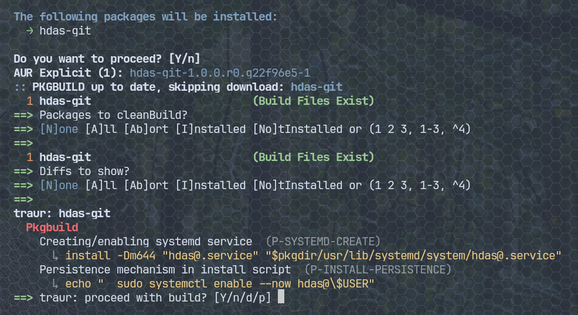

# traur

> A fork of [**Sohimaster/traur**](https://github.com/Sohimaster/traur),
> reworked into a plain findings reporter. The upstream project assigns a 0–100
> **trust score** with tiers and an ALPM hook that can block installs; this fork
> removes all of that in favor of listing the raw findings and letting you
> decide — plus an offline `makepkg` wrapper. If you want the trust-scoring
> tool, use upstream.

A findings-based security scanner for AUR PKGBUILDs, written in Rust. It
analyzes PKGBUILDs, `.install` scripts, source URLs, metadata, and git history
and reports the security-relevant **findings** it detects — no opaque trust
score, no tiers, no automatic blocking. You decide what the findings mean.

It can also wrap `makepkg` so that every AUR build (via yay/paru) is scanned
**offline** before it runs.



## Installation

This fork isn't on the AUR — build from source:

```bash
git clone https://github.com/adelmonte/traur
cd traur
cargo build --release
sudo install -Dm755 target/release/traur /usr/bin/traur
sudo install -Dm755 contrib/makepkg-traur /usr/share/traur/makepkg
```

Then, optionally, turn on the makepkg wrapper (see below):

```bash
sudo traur wrapper --enable
```

## Usage

```bash
traur scan <package>                 # fetch a package's PKGBUILD over HTTP and scan it
traur scan                           # scan all installed AUR packages
traur scan --pkgbuild ./PKGBUILD     # scan a local PKGBUILD (offline)
traur scan --pkgbuild ./PKGBUILD --source  # ...and print the PKGBUILD with flagged lines highlighted
traur ignore <SIGNAL-ID>             # suppress a specific finding
traur signals                        # list every finding traur can emit
```

Scanning a package by name pulls just the PKGBUILD and `.install` over HTTP from
AUR's cgit — nothing is cloned and no cache is kept on disk.

## makepkg wrapper

Scan PKGBUILDs automatically right before yay/paru builds them:

```bash
sudo traur wrapper --enable      # symlink the wrapper into /usr/local/bin/makepkg
traur wrapper                    # show status
sudo traur wrapper --disable     # remove it
```

The wrapper scans the package right before the build, prints the findings, then
asks before building. There are two scan modes (set per user, no sudo — they
live in your own `~/.config/traur/config.toml`):

```bash
traur wrapper --mode online    # default: local files + network signals (votes, stars, comments, bad-list)
traur wrapper --mode offline   # local files only — never touches the network
```

Either way the scan is bounded by a timeout, so a build can never hang. `online`
adds the findings that need the AUR/GitHub APIs; `offline` skips them for a
fully local, instant scan. Override for a single run with
`TRAUR_WRAPPER_MODE=offline yay -S <pkg>`.

At the prompt:

| Key | Action |
|-----|--------|
| `Y` / Enter | proceed with the build (default) |
| `n` | abort the build |
| `d` | show the git diff for this update (what changed), then ask again |
| `p` | show the PKGBUILD/`.install` with the flagged lines highlighted, then ask again |

When run non-interactively (e.g. a `--noconfirm` update) it prints the findings
and proceeds automatically.

## How it works

Independent features each emit the findings they detect:

| Feature | What it checks |
|---------|---------------|
| PKGBUILD analysis | Dangerous shell code |
| Install script analysis | Suspicious `.install` hooks |
| Source URL analysis | Untrusted source domains |
| Checksum analysis | Missing, skipped, or weak checksums |
| Shell analysis | Beyond-regex obfuscation (var concat, indirect exec, data blobs) — also over `.install` |
| GTFOBins analysis | Legitimate binary abuse — also over `.install` |
| Bin source verification | `-bin` package source domain vs upstream URL mismatch |
| Metadata analysis | AUR votes, popularity, maintainer status (online) |
| Name analysis | Typosquatting and brand impersonation |
| Maintainer analysis | New accounts, batch uploads (online) |
| Orphan takeover analysis | Submitter != maintainer, orphan takeover patterns (online) |
| Git history analysis | New network code, author changes (local git) |
| GitHub stars | Upstream repo missing or unpopular (online) |
| AUR comments analysis | Security warnings in recent comments (online) |
| Known-malicious list | Package appears on Arch's compromised-package list (online) |

Features marked *(online)* run when scanning a package by name, and in the
wrapper's `online` mode (the default). The `offline` mode (and a plain
`traur scan --pkgbuild` without `--online`) runs only the file-based and
local-git checks. *(local git)* features run when a `.git` is present (the
helper's build dir).

## Detection coverage

Patterns derived from real AUR malware incidents:
- **Atomic Arch supply-chain campaign (2026)** — build-time package-manager installs (`npm`/`pip`/`cargo`/…), escalated when the package was recently adopted (`B-ORPHAN-NET-INSTALL`), plus a check against Arch's known-compromised package list (`B-KNOWN-MALICIOUS`)
- **CHAOS RAT (2025)** — browser impersonation packages, RAT distribution
- **Google Chrome RAT (2025)** — `.install` script, Python download+execute
- **Acroread (2018)** — orphan takeover, curl from paste service, systemd persistence

Categories: download-and-execute, reverse shells, credential theft, persistence
mechanisms, privilege escalation, C2/exfiltration, cryptocurrency mining, code
obfuscation, kernel module loading, environment variable theft, system
reconnaissance.

## License

MIT
